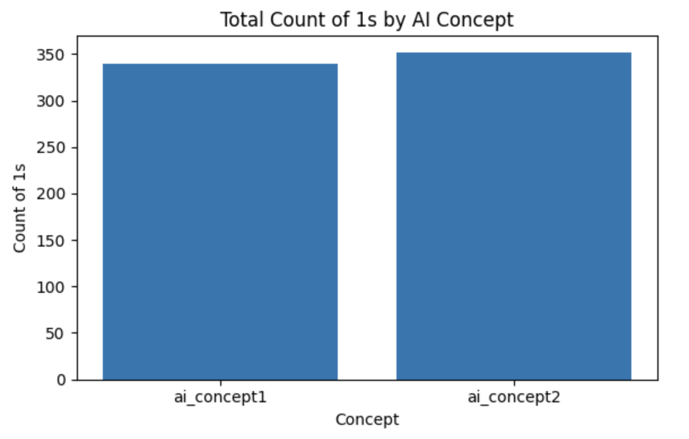
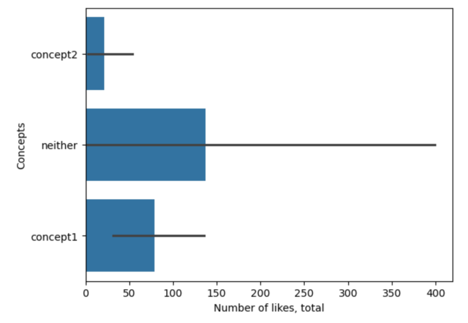

## LLM Prompt 
The prompt we used was really specific as it was hard to raise Krippendorf's concept higher than 0.65. Still, our final prompt is as follows: "You are a research assistant. You will receive a series of tiktok comments, please code each comment expresses a PRO-VEGAN (Concept 1), ANTI-VEGAN (Concept 2), BOTH, or NEITHER view on veganism.

A comment supports veganism when it expresses approval of veganism, vegetarianism, plant-based eating, animal protection, or ethical concern for animals; when it shows interest, curiosity, or intention to try vegan or vegetarian eating; when it describes a personal vegan or vegetarian experience; or when it responds positively to vegan or animal-friendly themes in the video. Comments showing empathy, sympathy, or moral concern for animals also support veganism. Heart emojis by themselves count as supporting veganism.

A comment opposes veganism when it expresses approval of eating meat, poultry, fish, seafood, dairy, eggs, or foods containing these ingredients; when it mentions wanting, craving, preferring, enjoying, joking about, or choosing animal-based foods; when it treats animals as food, even playfully or sarcastically; or when it dismisses, criticizes, or expresses annoyance toward veganism or vegan people. Food-desire emojis such as 😋, 🤤, or tongue-out emojis always count as opposing veganism. Comments that call animals cute but still suggest eating them also oppose veganism.

A comment expresses both sides only when it clearly contains both a pro-vegan element (such as support, empathy, or interest in veganism) and an anti-vegan element (such as desire to eat animal-based foods) at the same time.

A comment expresses neither side when it does not discuss veganism, animals, or food involving animal products, and does not show approval or disapproval toward veganism. Off-topic or unrelated comments belong in this category.

Your output must be exactly one label: 'CONCEPT 1', 'CONCEPT 2', 'BOTH', or 'NEITHER'."

## Inter-Rater Reliability Scores
Krippendorff’s Alpha between Human and AI:
- Concept 1: 0.750
- Concept 2: 0.702

## Reflection 
To get better agreement between us and the LLM, we had to change our instructions a lot. At first, our ideas for sorting comments were too simple (like "for" or "against" being vegan), which meant people made up their own rules for confusing comments, like those about eating fish. Our breakthrough was making the instructions very detailed and specific. We stopped trying to guess if a person was truly "supportive" and instead focused on the words they actually used. We gave examples of positive things (like using happy emojis or saying they want to switch) and negative things (like mocking the diet or defending eating meat). This new, specific understaindg left less room for guesswork, making sure everyone, including the LLM, coded the same comments in the same way, which finally improved our reliability scores.

## Graphs

Interestingly enough, while the comments leaning in favor of a vegan/vegetarian diet had more likes in total than that of the contrarian, they were not shown as much. Our understanding of this is that since this creator is vegan, she would clearly have a lot of vegans supporting her lifestyle and ideas. That would then show itself in the comments through support (aka liking). But since this topic is controversial, there will be a lot of singular pushback from other individuals not from her supporters, so their comments wouldn't be stuck in replies or buried elsewhere. 

 

In addition, it would also explain why concept 2 (those who oppose veganism) get the most replies. A lot of outrage would be ignited from supporters at the comments they would make and so an argument or clash would ensue. 

