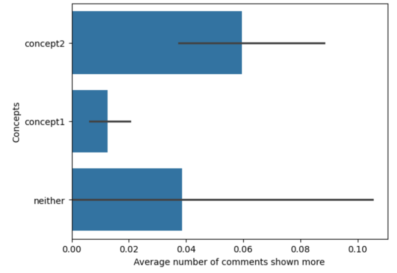
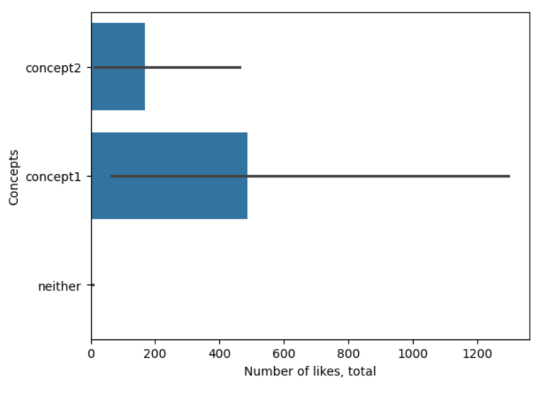
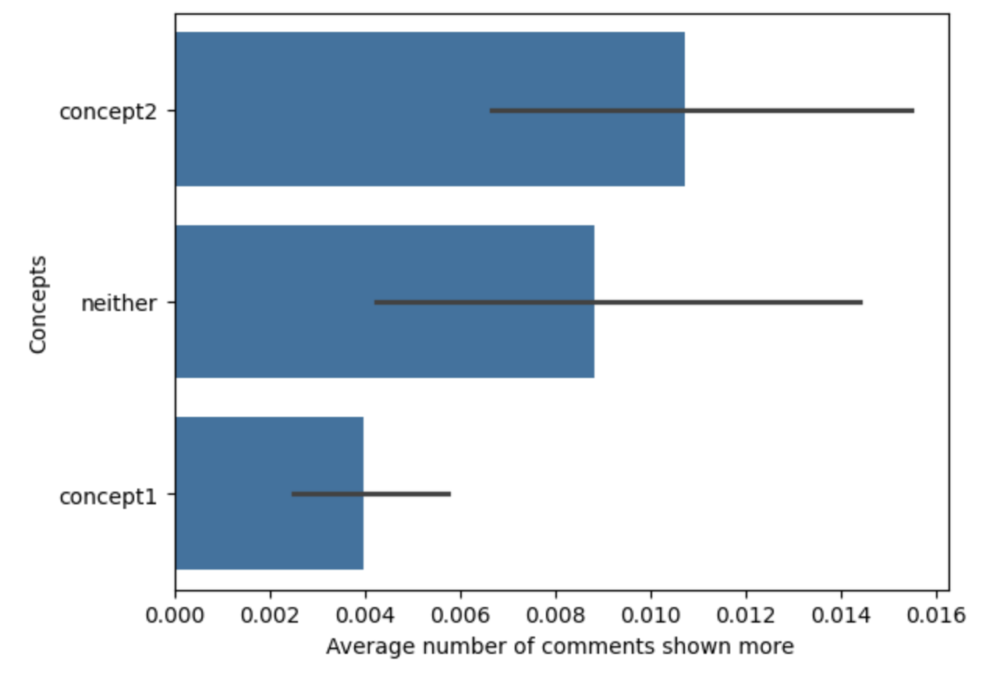

## LLM Prompt 
The prompt we used was really specific as it was hard to raise Krippendorf's concept higher than 0.65. Still, our final prompt is as follows: "explicitly, implicitly, or emotionally supports veganism, vegetarianism, or a plant-based diet. This includes expressing a desire to transition, praising the lifestyle/ethic, criticizing animal product consumption/industry, positive emojis, general positive affirmation toward the movement **OR** explicitly or implicitly opposes veganism, vegetarianism, or a plant-based diet. This includes mocking the lifestyle, defending eating meat/animal products, citing taste/naturalness/necessity, criticizing vegans/vegan efforts, or comments that intentionally seek to disrupt the vegan narrative (e.g., mentioning non-vegan ingredients, direct counter-commentary).

## Inter-Rater Reliability Scores
Krippendorff’s Alpha between Human and AI:
- Concept 1: 0.750
- Concept 2: 0.619

## Reflection 
To get better agreement between us and the LLM, we had to change our instructions a lot. At first, our ideas for sorting comments were too simple (like "for" or "against" being vegan), which meant people made up their own rules for confusing comments, like those about eating fish. Our breakthrough was making the instructions very detailed and specific. We stopped trying to guess if a person was truly "supportive" and instead focused on the words they actually used. We gave examples of positive things (like using happy emojis or saying they want to switch) and negative things (like mocking the diet or defending eating meat). This new, specific understaindg left less room for guesswork, making sure everyone, including the LLM, coded the same comments in the same way, which finally improved our reliability scores.

## Graphs

Interestingly enough, while the comments leaning in favor of a vegan/vegetarian diet had more likes in total than that of the contrarian, they were not shown as much. Our understanding of this is that since this creator is vegan, she would clearly have a lot of vegans supporting her lifestyle and ideas. That would then show itself in the comments through support (aka liking). But since this topic is controversial, there will be a lot of singular pushback from other individuals not from her supporters, so their comments wouldn't be stuck in replies or buried elsewhere. 

 

In addition, it would also explain why concept 2 (those who oppose veganism) get the most replies. A lot of outrage would be ignited from supporters at the comments they would make and so an argument or clash would ensue. 

